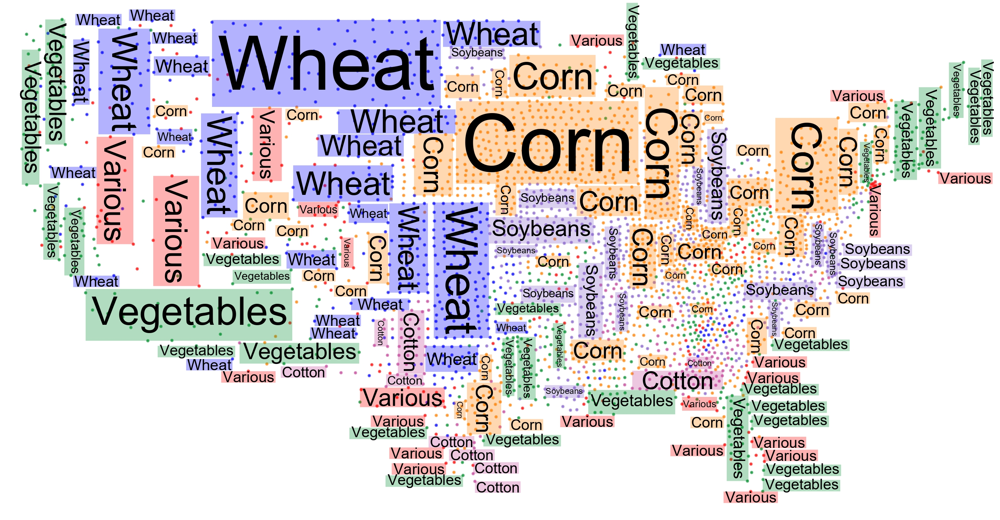
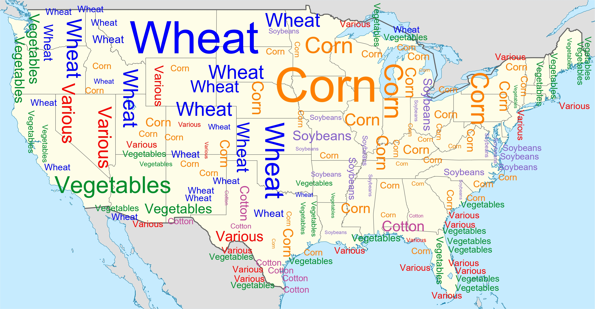

## Overview
Overview
Point feature labeling is a classical problem in cartography and GIS that has been extensively studied for geospatial point data.
At the same time, word clouds are a popular visualization tool to show the most important words in text data which has also been extended to visualize geospatial data (Buchin et al. PacificVis 2016).
We study a hybrid visualization, which combines aspects of word clouds and point labeling.
In the considered setting, the input data consists of a set of points grouped into categories and our aim is to place multiple disjoint and axis-aligned rectangles, each representing a category, such that they cover points of (mostly) the same category under some natural quality constraints.

In our visualization worbel, we then place category names inside the computed rectangles to produce a labeling of the covered points which summarizes the predominant categories globally (in a word-cloud-like fashion) while locally avoiding excessive misrepresentation of points (i.e., retaining the precision of point labeling). 

This is the open source project GeoWordle---a generator of geo word cloud with point label aggregation, developed at the Institute of Logic and Computation, TU Wien, Vienna, Austria. 

  

    
  

  

     
  

## Licence
This project is under MIT licence.

## Reference
If you want to know more about our implemented algorithms, please refer to our papers:
**Worbel: Aggregating Point Labels into Word Clouds** 
Sujoy Bhore, Robert Ganian, Guangping Li, Martin Nöllenburg, Jules Wulms 
Advances in Geographic Information Systems (SIGSPATIAL'21), pages 256–267, 2021, ACM. 
[[bibtex]](https://www.ac.tuwien.ac.at/publications/bglnw-wapliwc-21?file=../../publications/noellenburg-ac-web.bib) [[pdf]](https://arxiv.org/abs/2109.04368) [[doi]](https://dl.acm.org/doi/10.1145/3474717.3483959)

**Worbel: Aggregating Point Labels into Word Clouds**<be>
Sujoy Bhore, Robert Ganian, Guangping Li, Martin Nöllenburg, Jules Wulms<be>
ACM Trans. Spatial Algorithms and Systems, volume 9, number 3, pages 19:1–19:32, 2023.
[[bibtex]](https://www.ac.tuwien.ac.at/publications/bglnw-wapliwc-23?file=../../publications/noellenburg-ac-web.bib) [[doi]](https://dl.acm.org/doi/10.1145/3603376)

Please acknowledge our work if you publish your result using our algorithms or code.

## Download
Source code and benchmark instances (available in this [github repository](https://github.com/dyna-mis/geoWordle.git))

Benchmark data generator for point features (available in this [github repository](https://github.com/dyna-mis/geowordle_input_generator.git))

## Support
Please write us an Email if you have questions.

We are glad to get any comments and error reports.

A random instance generator is available upon request.

## Acknowledgments
GeoWordle is part of the project "Human-Centered Algorithm Engineering: Graph and Map Visualization" supported by the Austrian Science Fund (FWF) under Grant P31119, 31336 and Y1329.
